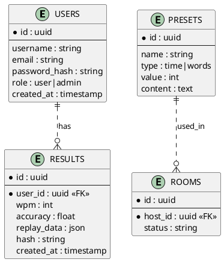

# Database Schema (ERD)

```plantuml
@startuml
entity "USERS" {
  *id : uuid
  --
  username : string
  email : string
  password_hash : string
  role : user|admin
  created_at : timestamp
}

entity "RESULTS" {
  *id : uuid
  --
  *user_id : uuid <<FK>>
  wpm : int
  accuracy : float
  replay_data : json
  hash : string
  created_at : timestamp
}

entity "PRESETS" {
  *id : uuid
  --
  name : string
  type : time|words
  value : int
  content : text
}

entity "ROOMS" {
  *id : uuid
  --
  *host_id : uuid <<FK>>
  status : string
}

USERS ||..o{ RESULTS : "has"
PRESETS ||..o{ ROOMS : "used_in"
@enduml
```