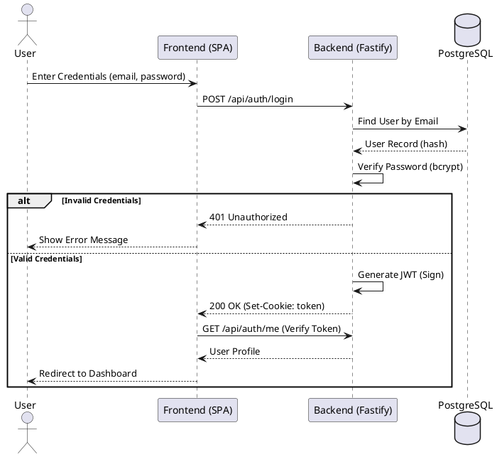

# Sequence Diagram: Authentication

```plantuml
@startuml
actor User
participant "Frontend (SPA)" as Frontend
participant "Backend (Fastify)" as API
database PostgreSQL as DB

User -> Frontend: Enter Credentials (email, password)
Frontend -> API: POST /api/auth/login
API -> DB: Find User by Email
DB --> API: User Record (hash)
API -> API: Verify Password (bcrypt)

alt Invalid Credentials
    API --> Frontend: 401 Unauthorized
    Frontend --> User: Show Error Message
else Valid Credentials
    API -> API: Generate JWT (Sign)
    API --> Frontend: 200 OK (Set-Cookie: token)
    Frontend -> API: GET /api/auth/me (Verify Token)
    API --> Frontend: User Profile
    Frontend --> User: Redirect to Dashboard
end
@enduml
```