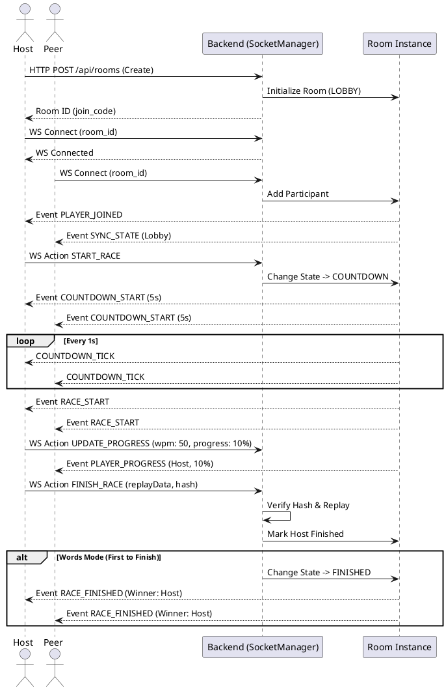

# Sequence Diagram: Multiplayer Race

```plantuml
@startuml
actor Host
actor Peer
participant "Backend (SocketManager)" as Server
participant "Room Instance" as Room

Host -> Server: HTTP POST /api/rooms (Create)
Server -> Room: Initialize Room (LOBBY)
Server --> Host: Room ID (join_code)
Host -> Server: WS Connect (room_id)
Server --> Host: WS Connected

Peer -> Server: WS Connect (room_id)
Server -> Room: Add Participant
Room --> Host: Event PLAYER_JOINED
Room --> Peer: Event SYNC_STATE (Lobby)

Host -> Server: WS Action START_RACE
Server -> Room: Change State -> COUNTDOWN
Room --> Host: Event COUNTDOWN_START (5s)
Room --> Peer: Event COUNTDOWN_START (5s)

loop Every 1s
    Room --> Host: COUNTDOWN_TICK
    Room --> Peer: COUNTDOWN_TICK
end
Room --> Host: Event RACE_START
Room --> Peer: Event RACE_START

Host -> Server: WS Action UPDATE_PROGRESS (wpm: 50, progress: 10%)
Room --> Peer: Event PLAYER_PROGRESS (Host, 10%)

Host -> Server: WS Action FINISH_RACE (replayData, hash)
Server -> Server: Verify Hash & Replay
Server -> Room: Mark Host Finished

alt Words Mode (First to Finish)
    Server -> Room: Change State -> FINISHED
    Room --> Host: Event RACE_FINISHED (Winner: Host)
    Room --> Peer: Event RACE_FINISHED (Winner: Host)
end
@enduml
```